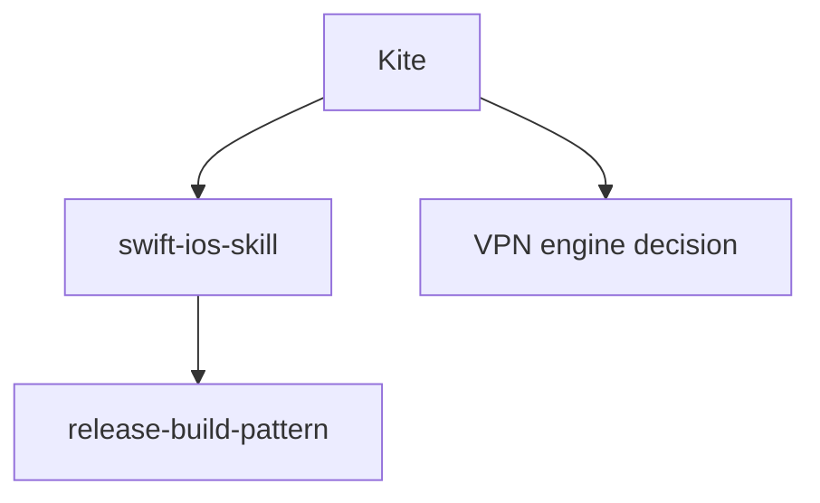

# GitNexus Ideas for AI Memory Vault

This document captures ideas worth borrowing from GitNexus-style code intelligence for AI Memory Vault.

> Note: GitNexus itself appears to use a non-commercial license in some integrations' license notes. Borrow product patterns and workflows, not code.

## What GitNexus gets right

### 1. Precomputed relational intelligence

GitNexus does not ask the agent to rediscover code relationships from raw files every time. It indexes first, then answers from a structured graph.

For AI Memory Vault, the equivalent is:

```text
raw memories / skills / patterns / project files
→ precomputed asset graph
→ fast context / claim / impact / promotion decisions
```

Do not make every agent re-read the whole vault. Build a deterministic index.

### 2. Resources before tools

GitNexus exposes lightweight resources such as context, clusters, processes, schema, and process traces. Agents can read small structured summaries before using heavier tools.

Borrow this as vault resources:

```text
vault://context
vault://assets
vault://project/<id>/context
vault://project/<id>/decisions
vault://skill/<id>/summary
vault://schema
```

For the CLI, start with local commands:

```bash
ai-vault context <project>
ai-vault list-assets
ai-vault asset <id>
ai-vault schema
```

### 3. Staleness checks

GitNexus compares indexed commit metadata with `HEAD` and warns when the index is stale.

Borrow this for vault claims:

- Record asset hashes in `.ai-memory/claimed-assets.json`.
- Add `ai-vault status <project>` to compare claimed hashes with current vault asset hashes.
- Report:
  - `fresh`
  - `stale`
  - `missing`
  - `local-only`
  - `visibility-changed`

### 4. Impact analysis before changes

GitNexus has `impact` and `detect_changes` to answer what breaks before editing.

Borrow this for memory operations:

```bash
ai-vault impact <asset-id>
ai-vault detect-changes
```

Expected questions:

- Which projects claimed this skill?
- Which project memories reference this pattern?
- Which agents would lose context if this asset is deleted?
- Does this proposal touch private assets that should not be public?
- What downstream claim manifests will become stale?

### 5. Generated repo-specific skills

GitNexus can generate repo-specific skills from functional clusters.

Borrow this as:

```bash
ai-vault generate-skills <project>
```

Inputs:

- `projects/<project-id>/files.md`
- `projects/<project-id>/commands.md`
- `projects/<project-id>/decisions.md`
- optional GitNexus-generated architecture/process data when available

Output:

```text
skills/generated/<project-id>-<area>/SKILL.md
```

Each generated skill should include:

- area purpose
- key files
- entry points
- verified commands
- known risks
- links to decisions/mistakes

### 6. Guided prompts / workflows

GitNexus exposes guided prompts like pre-commit impact analysis and architecture map generation.

Borrow as vault guided workflows:

```bash
ai-vault workflow promote-proposal <proposal>
ai-vault workflow project-onboarding <project>
ai-vault workflow pre-commit-memory-check
ai-vault workflow generate-map <project>
```

These should print checklists and write proposal files rather than mutating canonical memory blindly.

### 7. Architecture maps

GitNexus can generate maps from graph data.

Borrow for memory maps:

```bash
ai-vault map
ai-vault map <project>
```

Output Markdown + Mermaid:



This helps agents understand the vault as a system, not a folder tree.

### 8. Group / multi-repo contracts

GitNexus group mode models cross-repo contracts.

Borrow for multi-project memory:

```text
groups:
  - id: ai-product-stack
    projects: [ai-setup, ai-memory-vault, shanchuang]
    contracts:
      - name: openclaw-gateway-websocket
      - name: runninghub-api-client
```

Then add:

```bash
ai-vault group-sync
ai-vault group-context <group-id>
ai-vault group-impact <asset-id>
```

### 9. Auto-augment with an off switch

GitNexus integrations can auto-augment tool results but allow disabling when noisy.

Borrow as:

```bash
ai-vault config auto-context on|off
```

Agents should be able to request compact vault context automatically, but the user must be able to turn it off.

### 10. Safe rename / migration previews

GitNexus supports graph-assisted rename with dry-run preview.

Borrow for asset migration:

```bash
ai-vault rename-asset old-id new-id --dry-run
ai-vault rename-asset old-id new-id --apply
```

Must update:

- `registry.yaml`
- claim manifests if present
- links in project memory
- generated maps
- docs references

## Recommended next sprint

### P0

1. `ai-vault status <project>`
   - compare local claim manifest with current vault registry/assets
   - report stale/missing/visibility-changed assets

2. `ai-vault list-assets` and `ai-vault asset <id>`
   - progressive disclosure primitives
   - avoid loading the whole vault

3. asset links metadata
   - `relates_to`
   - `supersedes`
   - `depends_on`
   - `claimed_by`
   - `applies_to`

### P1

4. `ai-vault impact <asset-id>`
   - show which projects/skills/patterns depend on or claim the asset

5. `ai-vault map [project]`
   - generate Mermaid graph of project ↔ skills ↔ patterns ↔ decisions

6. `ai-vault promote <proposal>`
   - guided promotion from inbox proposal to canonical project memory

### P2

7. optional GitNexus bridge
   - If `.gitnexus/` exists in a project, include a note in `ai-vault context`.
   - Later: import GitNexus generated skills or architecture summaries as proposals.

## Core lesson

GitNexus is valuable because it turns implicit structure into explicit, queryable relationships.

AI Memory Vault should do the same for memory:

```text
implicit scattered AI knowledge
→ explicit asset graph
→ queryable context, impact, status, and safe promotion workflows
```
